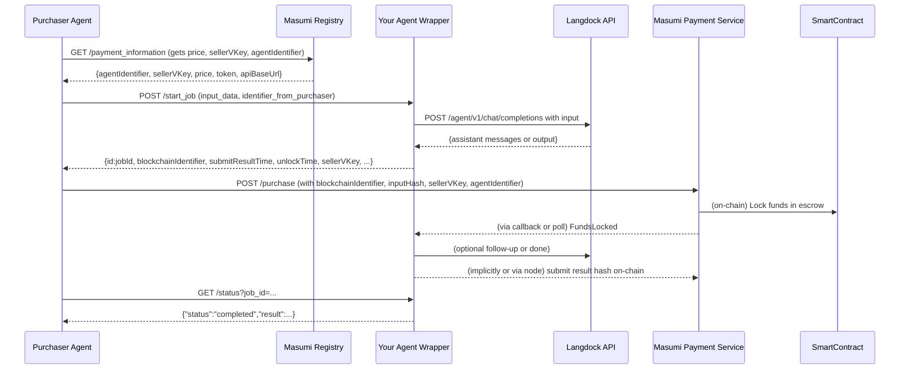

# Production-Ready Langdock→Masumi Wrapper Service

**Executive Summary:** To integrate a Langdock agent as a payable Masumi/Sokosumi service, the wrapper must implement the Masumi Agentic Service API (MIP-003) and forward requests to Langdock.  In practice this means building a backend that exposes **POST /start_job**, **GET /status**, and **GET /availability** (health) endpoints (plus optional `/input_schema`, `/demo`, `/provide_input` for HITL)【28†L97-L105】【26†L389-L397】.  The wrapper’s **/start_job** handler receives the user input, computes the required hashes (input_hash per MIP-004), calls the Langdock agent via its API, and returns the `jobId`, `blockchainIdentifier`, timing fields, and `input_hash` as per Masumi spec【28†L128-L137】【37†L87-L94】.  The **/status** endpoint reports the job’s current state (`awaiting_payment`, `running`, `completed`, etc.) and returns results when ready【28†L189-L197】【39†L303-L311】.  The **/availability** (health) endpoint simply reports `"status": "available"` if the service is up【26†L389-L397】. 

Implementation details include securely handling the Langdock API key and Masumi payment flows.  The wrapper should store job state (with Redis or a database) and support idempotency via `input_hash`【28†L145-L148】【37†L106-L110】.  It must respect Langdock’s 500 RPM and 60,000 TPM rate limits【22†L277-L284】 and avoid exposing keys to the browser【22†L261-L270】.  For completeness and production readiness, we consider streaming vs. polling modes, retries on error, observability (logging/metrics), storage choices, deployment, CI/CD, and testing.  Below we detail these facets, with tables, code snippets, and a sequence diagram of the integration flow.

## 1. Masumi API Endpoints (MIP-003)

Masumi’s **Agentic Service API (MIP-003)** specifies the endpoints a service must expose【7†L67-L75】:

- **POST `/start_job`** – Initiate a job. **Request**: JSON with `identifier_from_purchaser` (user-provided nonce) and `input_data` (an object matching the service’s schema)【28†L97-L105】.  
  **Response**: JSON including a unique `id` (jobId), plus payment fields (`blockchainIdentifier`, `submitResultTime`, `unlockTime`, etc.), the agent’s `agentIdentifier`, `sellerVKey`, echoed `identifierFromPurchaser`, and the `input_hash` (SHA256 of the input data)【28†L128-L137】.  
  Example response fields:
  ```json
  {
    "id": "18d66eed-6af5-4589-b53a-d2e78af657b6",
    "blockchainIdentifier": "block_789def",
    "agentIdentifier": "resume-wizard-v1",
    "sellerVKey": "addr1qxlkjl...sdflkjsdf",
    "identifierFromPurchaser": "resume-job-123",
    "input_hash": "a87ff679a2f3e71d9181a67b7542122c",
    "submitResultTime": 1717171717,
    "unlockTime": 1717172717,
    "externalDisputeUnlockTime": 1717173717
  }
  ```  
  Error codes: 400 if required fields are missing or invalid; 500 for internal errors【28†L165-L169】.

- **GET `/status?job_id=...`** – Get job status/result. **Response**: JSON with `status` (one of `"awaiting_payment"`, `"awaiting_input"`, `"running"`, `"completed"`, `"failed"`)【28†L189-L197】.  If `status` is `"awaiting_input"`, an `input_schema` (JSON schema for additional user input) is included.  If `status` is `"completed"`, a `result` field (or structured output) is returned【28†L205-L214】.  Errors: 404 if `job_id` not found, 500 on server failure【39†L303-L311】.

- **POST `/provide_input`** *(optional for Human-in-Loop)* – Submit extra input when status is `"awaiting_input"`. **Response**: returns `input_hash` and a signature of the input, per Masumi’s HITL spec (MIP-003 defines this)【4†L228-L236】.  Errors: 400/404/500 as per spec【39†L373-L377】.

- **GET `/availability`** – Health check. Returns `{"status":"available","type":"masumi-agent","message":"... ready ..."}` if the service is up【26†L389-L397】.  A 500 error indicates failure【39†L403-L406】.

- **GET `/input_schema`** and **GET `/demo`** – (Optional) Return input schema definition and sample I/O for marketing. If implemented, follow MIP-003 field formats【26†L408-L417】【26†L569-L578】.  They aid clients but are not strictly required for production.

All responses should follow JSON and use appropriate status codes per MIP-003【39†L303-L311】【39†L373-L377】.  For example, a completed job’s status response might be:
```json
{
  "status": "completed",
  "result": {"text": "Here is your summary..."}
}
```
or with structured output if requested (see Structured Output below).

## 2. Langdock Integration

The wrapper’s core function is to call the Langdock **Agent Completion API** when `/start_job` is invoked. This requires configuring Langdock and handling its auth:

- **Agent Setup:** In the Langdock UI, create your agent (with its workflow/tools), then share it with an API key【16†L139-L147】【16†L153-L162】.  As admin, generate a workspace API key (scope “Agent API” or “Assistant API”) and add it via the agent’s “Share” dialog【16†L139-L147】. This gives programmatic access to the agent.

- **Auth:** Call Langdock API using `Authorization: Bearer <API_KEY>`【22†L261-L270】. Store `LANGDOCK_API_KEY` (and agent ID) in backend environment variables, never in client code. Langdock **blocks browser-origin requests** to protect keys【22†L267-L274】, so the wrapper must be server-side. The base URL is `https://api.langdock.com` (or your deployment’s `/api/public` prefix)【22†L238-L247】.

- **Invocation:** On `/start_job`, the wrapper formats the user’s input into a Vercel AI SDK “UIMessage” array and POSTs to Langdock’s `/agent/v1/chat/completions` endpoint【19†L240-L249】. For example:
  ```bash
  curl -X POST https://api.langdock.com/agent/v1/chat/completions \
       -H "Authorization: Bearer $LANGDOCK_API_KEY" \
       -H "Content-Type: application/json" \
       -d '{
         "agentId": "AGENT_ID",
         "messages": [{"id": "m1","role": "user","parts":[{"type":"text","text":"INPUT_TEXT"}]}],
         "stream": false
       }'
  ```
  The `messages` format follows Langdock’s UIMessage spec (see API)【19†L248-L256】【19†L269-L277】.

- **Options:** You can include optional params:
  - **Streaming (`stream: true`):** Langdock will return a streamed response (SSE chunks) in Vercel AI format【20†L443-L451】. This is useful for real-time UIs but complicates escrow flows.  
  - **Structured Output:** Include an `"output": {type: "...", schema: ...}` object to enforce JSON output【20†L419-L427】. When used, the API response includes an `output` field with parsed JSON【20†L545-L554】. This is helpful to ensure machine-readable results.

- **Tool Calls:** If the Langdock agent uses tools/actions, ensure none require **human confirmation**, as the API cannot handle interactive approvals【20†L401-L409】. All API-invoked tools must be pre-approved.

- **Response Handling:** Langdock returns `{"messages":[ ... ]}`. For a simple case, one message with `role: "assistant"` and `content` is returned. Extract the assistant’s content or structured `output`. If streaming, accumulate chunks. Then include that result in your `/status` reply.

- **Error Handling:** Detect HTTP errors (429 rate-limit, 5xx Langdock errors). On failure, set job status to `"failed"`, store error info, and return 5xx in the wrapper’s own responses. On transient network errors, you may retry once. (Masumi nodes will see a failed result via `status` and can optionally refund【37†L120-L124】.)

## 3. Job Lifecycle & Masumi Payments

Integrating with Masumi means the wrapper must support the payment escrow flow【37†L87-L94】【37†L102-L110】. A typical flow:



**Key Points:**  
- After **/start_job**, Masumi’s registry tells the buyer which asset to lock and where.  The wrapper returns a `blockchainIdentifier` that ties the job to the on-chain purchase【37†L87-L94】.  
- The buyer then calls Masumi’s **POST /purchase** API (Payment Service) to lock funds with the provided `inputHash`【37†L102-L110】.  The Masumi node handles on-chain transactions in the background.  
- The wrapper’s owner’s Masumi node will **not begin executing** until it sees `FundsLocked` on-chain【37†L87-L94】, ensuring the agent only works once paid. (Implementers can poll `/purchase` or use Masumi’s callback to detect this.)  
- **Polling**: The buyer polls both Masumi’s `/purchase` and the wrapper’s `/status`. Once funds are locked, the wrapper moves from `awaiting_payment` to `running`. When complete, the wrapper returns `status: "completed"` with results【37†L120-L124】.  
- **Result Verification:** Masumi requires hashing the result (`result_hash`) on-chain for accountability. The Masumi Node normally does this automatically, but the wrapper should output the raw result so the buyer can verify it.  Always ensure the output’s hash matches the on-chain `result_hash` (see MIP-004)【37†L120-L124】.  
- **HITL / `/provide_input`:** If your agent workflow uses Masumi’s Human-in-the-Loop, the wrapper must support `awaiting_input`. When Masumi user calls `/provide_input`, pass that to the Langdock agent (e.g. include the new user message in conversation) and update the job status to `running`【39†L313-L322】【39†L373-L377】.

In summary, treat the Masumi Payment flow as external orchestration: **/start_job** returns job/payment info, then Masumi’s lock triggers work, then **/status** returns the completed output.

## 4. Polling vs Streaming (Design Choices)

| Aspect              | Polling (`/status`)                 | Streaming (`/agent/v1/chat/completions?stream=true`)        |
|---------------------|-------------------------------------|-------------------------------------------------------------|
| Integration         | Matches MIP-003 (asynchronous API) | Requires streaming client; not part of MIP-003 spec           |
| Latency             | Depends on poll interval (e.g. 1–5s)| Low, real-time updates per token                               |
| Complexity          | Simple (HTTP GET)                   | Complex (hold open HTTP connection, SSE parsing)             |
| Client Support      | Works with any HTTP client          | Requires streaming/SSE support on client (e.g. `fetch` reader)【20†L490-L499】 |
| Payment Interaction | Buyer calls `/status` to get result | Hard to interleave with escrow (lock must complete before final output) |
| Use Case            | Suitable for multi-step or long jobs (fits escrow flow) | Good for chatty responses or live UI (less needed in escrow context) |

**Recommendation:** Use polling by default. Implementing streaming is optional (Langdock supports it【20†L443-L451】), but Sokosumi/Masumi expects the agent to return an async job result. If you do use streaming (e.g. for a responsive UI), ensure the final output is still captured and returned via `/status`. 

## 5. Error Handling & Retries

- **Wrapper Errors:** Validate all incoming requests. Return HTTP 400 for missing/invalid fields. On unexpected exceptions, return 500. Follow MIP-003’s error guidelines (e.g. `/status` returns 404 if `job_id` not found【39†L303-L311】).  
- **Langdock Errors:** If the Langdock API call fails (HTTP 4xx/5xx), mark the job status `"failed"` and include the error in logs. You may retry once on network timeouts. If Langdock returns a valid JSON error, propagate that message.  
- **Rate Limits:** Watch Langdock’s 429 responses (500 RPM limit【22†L277-L284】). If rate-limited, back off and retry after a pause. Consider queueing requests or using a semaphore to limit concurrent calls.  
- **Masumi Errors:** The Masumi Node/SDK will handle on-chain failures. If the Masumi `/purchase` flow hits an issue (e.g. insufficient funds), the buyer will not lock funds and the job stays `awaiting_payment`. The wrapper can optionally time out or cancel after a threshold.  

In all cases, log errors with enough context (job ID, Langdock error, stack trace) for debugging. Return concise error messages to clients without leaking secrets.

## 6. Security

- **Secrets:** Store the Langdock API key and agent ID in backend-only environment variables. Do **not** expose them in client code or browser.  
- **CORS:** Configure CORS to allow only trusted origins (e.g. Sokosumi’s domain) if the wrapper is called from a browser. Ideally, the wrapper is a backend API with no public browser UI, so disable public CORS completely.  
- **Authentication:** Masumi/MCP supports calling agent APIs via signed token or JWT. The wrapper could require that Masumi Payment Service (or the buyer) present a valid Masumi token. At minimum, verify that calls to `/status` and `/start_job` include the `identifier_from_purchaser` originally given in `/start_job`. (This nonce helps prevent replay attacks.)  
- **Data Integrity:** Use MIP-004 hashing for input and output. The buyer computes `input_hash` before calling /purchase; the wrapper returns the same `input_hash` in `/start_job`【28†L145-L148】【37†L106-L110】. After execution, the wrapper (or Masumi node) should verify output by hashing with the same identifier【34†L89-L98】【34†L124-L133】.  
- **Transport Security:** Use HTTPS for all calls. Langdock requires TLS; your wrapper endpoints should be HTTPS.  

## 7. Storage & Idempotency

- **Job Store:** Maintain an in-memory store for job state (pending/completed/failed, input/output, errors). For short-lived wrappers, an in-process map might suffice, but a persistent store is safer. Options: **Redis** (fast, supports TTLs) or a database (SQL/NoSQL).  
- **Redis vs. DB:** Redis offers millisecond performance and auto-expiry (e.g. expire jobs after 24h). However, it is volatile (in-memory) unless using persistence. A SQL or NoSQL DB is durable but adds latency and schema overhead. For resiliency, a DB (e.g. PostgreSQL or Mongo) ensures jobs aren’t lost if the service restarts. Evaluate your scale: Redis is fine for <1k jobs/min; for more throughput, a cluster or DB is better.  
- **Idempotency:** Implement idempotency so that repeated calls with the same input don’t create duplicate jobs. Use the combination (`identifier_from_purchaser`, input_hash) as a unique key. If a `/start_job` arrives with a known identifier or hash, return the existing `jobId` and status instead of creating a new one. This follows MIP-003 advice of idempotent design.  
- **Hashes:** Compute `input_hash` using MIP-004 (canonical JSON + identifier)【34†L94-L103】【34†L125-L134】. After completing the job, optionally compute an `output_hash` for logging (MIP-004 specifies this, though the API doesn’t include it). Storing these hashes enables auditability.

## 8. Logging & Observability

- **Request Logging:** Log each `/start_job` and `/status` request with a correlation ID (e.g. the Masumi `identifier_from_purchaser` or jobId). Include timestamps, input summary (not sensitive content), and source IP.  
- **Error Logging:** Capture stack traces on exceptions, and log Langdock API responses (headers & body) for failures (sanitized). Use structured logging (JSON) so you can query logs in Elasticsearch/Cloud logging.  
- **Metrics:** Expose Prometheus metrics (or similar) for:
  - Requests per endpoint (`/start_job`, `/status`, `/availability`)
  - Success vs. failure counts
  - Langdock API call latency and status codes
  - Job processing time (histogram of job durations)
  - In-flight job count
  - Queue length (if async)
- **Health Checks:** The **/availability** endpoint acts as a live HTTP health check. Integrate with container platforms (e.g. k8s Liveness probe).  
- **Tracing:** Use distributed tracing (OpenTelemetry) if available, tagging traces with `jobId`. This helps diagnose slow calls (e.g. network vs. Langdock processing time).  
- **Security Logs:** Log authentication failures or invalid requests (e.g. missing API key) to alert of potential misuse.

## 9. Design Options Comparison

Below are tables comparing major design choices:

**Sync vs. Async Invocation:**  

| Approach           | Description                                                    | Pros                                              | Cons                                              |
|--------------------|----------------------------------------------------------------|---------------------------------------------------|---------------------------------------------------|
| **Synchronous**    | Wrapper calls Langdock synchronously within `/start_job`, then immediately writes result and returns *final* output via `/status`. | Simpler (single request), no separate job worker. | Long latency for user (API call blocks). Scalability limited by max request timeouts. |
| **Asynchronous**   | `/start_job` enqueues job, returns a `jobId` immediately. A background worker (or separate process) polls Langdock and updates the job store. | Decouples request from processing, handles long jobs. Better resilience and parallelism. | More complexity (queue, worker pool, job persistence). Must store state between calls. |
| **Streaming**      | (If used) The frontend subscribes to a stream and receives partial output. Not standard in MIP-003. | Low-latency interactive output, good UX for chatty agents. | Hard to combine with escrow (finalization). Requires client that can handle streaming SSE. |

For Masumi integration, **polling (asynchronous)** is often used, since payment locking adds delay. Synchronous is acceptable for very fast agents, but ensure you return within client timeouts. 

**Data Storage:**  

| Option         | Pros                                           | Cons                                           |
|----------------|------------------------------------------------|------------------------------------------------|
| **Redis**      | Very fast in-memory reads/writes, support TTL. Good for simple queue storage. | Data lost if container restarts (unless using persistence). Limited complex queries. |
| **PostgreSQL** | Persistent, relational, supports transactions and indexing. | Slower I/O, more setup. Requires schema/migrations. |
| **NoSQL DB**   | Schema-less, horizontally scalable (e.g. Mongo). Good for JSON-like job data. | Eventual consistency concerns, added complexity, potentially higher cost. |

For small to medium loads, Redis with RDB/AOF persistence is common. For enterprise reliability, a SQL database ensures no data loss. 

**Polling vs Streaming (Langdock):**

| Feature        | Polling (`/status`)                   | Streaming API                                     |
|----------------|---------------------------------------|---------------------------------------------------|
| **Use in Masumi Flow** | Matches Masumi’s async model【28†L189-L197】 | Not defined in MIP-003 (requires custom integration). |
| **Implementation** | Regular GET, simple clients | SSE or WebSocket, requires special handling【20†L443-L451】. |
| **Latency**    | Moderate (seconds, depending on poll interval) | Low, near real-time token streaming. |
| **Failure Mode** | Can retry polling, simpler error handling | Must handle stream resets, partial data loss. |

## 10. Reference Implementation Outline

Below are outlines for Express (Node.js) and FastAPI (Python) implementations. These illustrate the key parts: auth, calling Langdock, job store, and endpoints. (Error handling/logging omitted for brevity.)

### Node.js (Express) Example

```js
import express from "express";
import fetch from "node-fetch";
import { nanoid } from "nanoid";

const app = express();
app.use(express.json());

const LANGDOCK_API_KEY = process.env.LANGDOCK_API_KEY;
const AGENT_ID = process.env.LANGDOCK_AGENT_ID;

// Simple in-memory job store (use Redis/DB in prod)
const jobs = {};

app.post("/start_job", async (req, res) => {
  const identifier = req.body.identifier_from_purchaser;
  const inputData = req.body.input_data || {};
  const inputJson = JSON.stringify(inputData);
  const inputHash = /* compute SHA256 hash as per MIP-004 */;

  const jobId = nanoid();
  jobs[jobId] = { status: "pending" };

  // Call Langdock
  try {
    const langdockRes = await fetch("https://api.langdock.com/agent/v1/chat/completions", {
      method: "POST",
      headers: {
        "Authorization": `Bearer ${LANGDOCK_API_KEY}`,
        "Content-Type": "application/json"
      },
      body: JSON.stringify({
        agentId: AGENT_ID,
        messages: [{ id: nanoid(), role: "user", parts: [{ type: "text", text: req.body.input_data.text || "" }] }],
        output: { type: "object" }  // if expecting JSON
      })
    });
    const langdockData = await langdockRes.json();

    // Save result (could be streamed instead)
    jobs[jobId] = {
      status: "completed",
      result: langdockData.output || langdockData.messages[0].content,
      output_hash: /* hash of result per MIP-004 */,
      input_hash: inputHash
    };

    // Return jobId & payment info to caller
    res.json({
      id: jobId,
      blockchainIdentifier: langdockData.blockchainIdentifier,  // if you generated one
      payByTime: Math.floor(Date.now()/1000) + 3600,
      submitResultTime: Math.floor(Date.now()/1000) + 1800,
      unlockTime: Math.floor(Date.now()/1000) + 2700,
      externalDisputeUnlockTime: Math.floor(Date.now()/1000) + 3600,
      agentIdentifier: "your-agent-name",
      sellerVKey: "your-seller-wallet-vkey",
      identifierFromPurchaser: identifier,
      input_hash: inputHash
    });
  } catch (err) {
    jobs[jobId] = { status: "failed", error: err.message };
    res.status(500).json({ error: "Agent execution failed" });
  }
});

app.get("/status", (req, res) => {
  const job = jobs[req.query.job_id];
  if (!job) return res.status(404).json({ status: "not_found" });
  res.json({ status: job.status, result: job.result });
});

app.get("/availability", (req, res) => {
  res.json({ status: "available", type: "masumi-agent", message: "Agent ready" });
});

app.listen(3000, () => console.log("Wrapper running on port 3000"));
```

### Python (FastAPI) Example

```python
from fastapi import FastAPI, HTTPException
from pydantic import BaseModel
import requests, hashlib, uvicorn

app = FastAPI()

LANGDOCK_KEY = os.getenv("LANGDOCK_API_KEY")
AGENT_ID = os.getenv("LANGDOCK_AGENT_ID")
jobs = {}

class StartJobReq(BaseModel):
    identifier_from_purchaser: str
    input_data: dict = {}

@app.post("/start_job")
async def start_job(req: StartJobReq):
    identifier = req.identifier_from_purchaser
    input_data = req.input_data
    # Compute input_hash per MIP-004
    canon_json = json.dumps(input_data, sort_keys=True, separators=(',',':'))
    preimage = f"{identifier};{canon_json}"
    input_hash = hashlib.sha256(preimage.encode()).hexdigest()

    job_id = str(uuid.uuid4())
    jobs[job_id] = {"status": "pending"}

    # Call Langdock API
    payload = {
        "agentId": AGENT_ID,
        "messages": [{"id": job_id, "role": "user", "parts":[{"type":"text","text":input_data.get("text","") }]}]
    }
    headers = {"Authorization": f"Bearer {LANGDOCK_KEY}", "Content-Type": "application/json"}
    resp = requests.post("https://api.langdock.com/agent/v1/chat/completions", json=payload, headers=headers)
    if resp.status_code != 200:
        jobs[job_id]["status"] = "failed"
        raise HTTPException(status_code=502, detail="Langdock error")
    lang_res = resp.json()
    result = lang_res.get("output") or (lang_res["messages"][0]["content"] if lang_res.get("messages") else "")

    jobs[job_id] = {"status": "completed", "result": result}
    return {
        "id": job_id, 
        "blockchainIdentifier": "block_xyz",
        "agentIdentifier": "resume-agent",
        "sellerVKey": "addr1qxyz...",
        "identifierFromPurchaser": identifier,
        "input_hash": input_hash,
        "payByTime": int(time.time()) + 3600,
        "unlockTime": int(time.time()) + 2700,
        "externalDisputeUnlockTime": int(time.time()) + 3600
    }

@app.get("/status")
async def status(job_id: str):
    job = jobs.get(job_id)
    if not job:
        raise HTTPException(status_code=404, detail="Job not found")
    return {"status": job["status"], "result": job.get("result")}

@app.get("/availability")
async def health():
    return {"status": "available", "type": "masumi-agent", "message": "Service OK"}
```

These outlines illustrate the key flow. In production, use a robust job queue (BullMQ, Celery, RQ, etc.) and persistent store instead of in-memory dicts.

## 11. Deployment & CI/CD

**Deployment Options:** For production, consider:

- **Railway.app** – A cloud platform with easy setup (Docker/Git deploy). Good for prototyping and small scale【40†L105-L113】. It can run both Masumi Node (via their template) and your agent wrapper as separate projects. 
- **Vercel/Netlify (Serverless)** – If low latency isn’t critical, you can deploy the wrapper as serverless functions. Ensure environment variables for secrets. Vercel’s Node/Go/Python support works, but SSE streaming is limited.  
- **Docker (anyhost)** – Containerize the wrapper. Use Docker Compose or Kubernetes for scaling. This is the most flexible and can be combined with orchestration (e.g. k8s). The Masumi docs recommend separate hosting for Node and agents【40†L62-L70】, so run your wrapper container independently.  
- **Kubernetes (k8s)** – For high scale, deploy via Helm/Deployment with horizontal autoscaling. Use readiness probes hitting `/availability`.  
- **On-Prem or Cloud VM** – You can host on any VPS (AWS EC2, GCP VM, etc.), using systemd or Docker for processes. Ensure sufficient memory/CPU for Langdock calls and any local tools.

**CI/CD:** Use GitHub Actions or similar:

1. **Build and Test:** On each push, run linters, unit tests (mock Langdock with a fake server), and integration tests (`/start_job` and `/status`).  
2. **Docker Build:** Build a Docker image and push to a registry.  
3. **Deploy:** Trigger a deployment (e.g. via `gcloud run deploy`, `kubectl apply`, or Railway CLI). For serverless, push changes to the appropriate repo.  
4. **Rollback:** Tag releases and enable easy rollback.  

Include end-to-end tests: simulate a Masumi purchase by mocking the payment service and calling the endpoints as a buyer would. Validate `input_hash` logic (see **Tests** below).

## 12. Testing Strategy

- **Unit Tests:** For hashing (MIP-004), JSON schema parsing, and the HTTP handlers. Test that `/start_job` returns correct fields for valid/invalid input.  
- **Mock Langdock:** Use a local HTTP mock or the Langdock "Try it" API with a fake agent to test error and success flows.  
- **Integration Tests:** Spin up the wrapper (in memory) and simulate a full flow: call `/start_job`, then `/status`, including simulating the Masumi payment locks. For HITL, test `/provide_input`.  
- **Rate-limit Tests:** Ensure the wrapper gracefully handles a burst of requests (simulate 600 RPM).  
- **CI/CD Checks:** Include schema validation (MIP-003 /input_schema format) and contract tests that responses match the Masumi spec.  

## 13. Migration & Limitations

- **Hybrid vs Rebuild:** Starting with a **wrapper** is quicker (Option 3). Over time, you may rewrite agent logic directly in Masumi-compatible code (e.g. a Masumi SDK agent) and drop Langdock. This hybrid approach means you maintain Langdock for complex agents initially, then incrementally shift functionality in-house.  
- **Langdock Limitations:** Tools that require “human confirmation” in Langdock will **not** work over the API【20†L401-L409】. Any agent step requiring real human approval must be removed or handled via the Masumi `/provide_input` flow.  
- **SLA:** Langdock API’s availability and performance are out of your control. Design your wrapper to handle occasional Langdock downtime (retry/backoff) and to scale under Langdock’s rate limits【22†L277-L284】.  
- **Ownership & IP:** The wrapper’s code is yours, but the Langdock agent and its tools are the client’s. Ensure licenses permit this integration. All input/output data flows through your service—make sure to handle any PII or IP appropriately (e.g. data retention policies).

## 14. Onboarding Checklist

Before client (agent provider) can use your wrapper, ensure:

- **Langdock Setup:** They have a Langdock workspace and the agent is created.  
- **API Key:** They create a Langdock API key (Agent scope) and share their agent with it【16†L139-L147】.  
- **Agent ID:** They provide you the Langdock `agentId` (from the URL in app.langdock.com).  
- **Masumi Registration:** Their agent is registered on Masumi and has an `agentIdentifier`.  
- **Payment Info:** Confirm their agent’s on-chain `sellerVKey` (from Masumi Registry), and which token (USDM) they accept (per network)【24†L71-L80】.  
- **Environment:** They give you (or you generate) the `sellerVKey`, agentIdentifier, and Masumi Node URL.  
- **Schema:** They define the `input_schema` for your `/input_schema` endpoint (if needed) and ensure MIP-004 hashes will match their expectations.  

Once these are in place, the agent can be listed on Sokosumi (requires MIP-003 compliance【24†L54-L61】). 

## 15. Sources

- Masumi MIP-003 API standard (endpoints, schemas, examples)【28†L97-L105】【28†L128-L137】【28†L189-L197】【39†L303-L311】.  
- Masumi Payment Flow (buyer/seller escrow steps)【37†L87-L94】【37†L102-L110】【37†L120-L124】.  
- Masumi MIP-004 hashing spec (input/output hashing)【34†L94-L103】【34†L125-L134】.  
- Langdock API docs – Agent completion endpoint, authentication, rate limits【22†L277-L284】【20†L443-L451】.  
- Langdock “Sharing Agents” guide (API key usage)【16†L139-L147】.  
- Masumi Sokosumi listing guide (requirements)【24†L54-L61】.  
- Masumi Hosting Guide (deployment recommendations)【40†L105-L113】【40†L127-L135】.  

These official docs ensure compliance with both Langdock’s and Masumi’s requirements. Additional best practices were drawn from each platform’s developer guides.